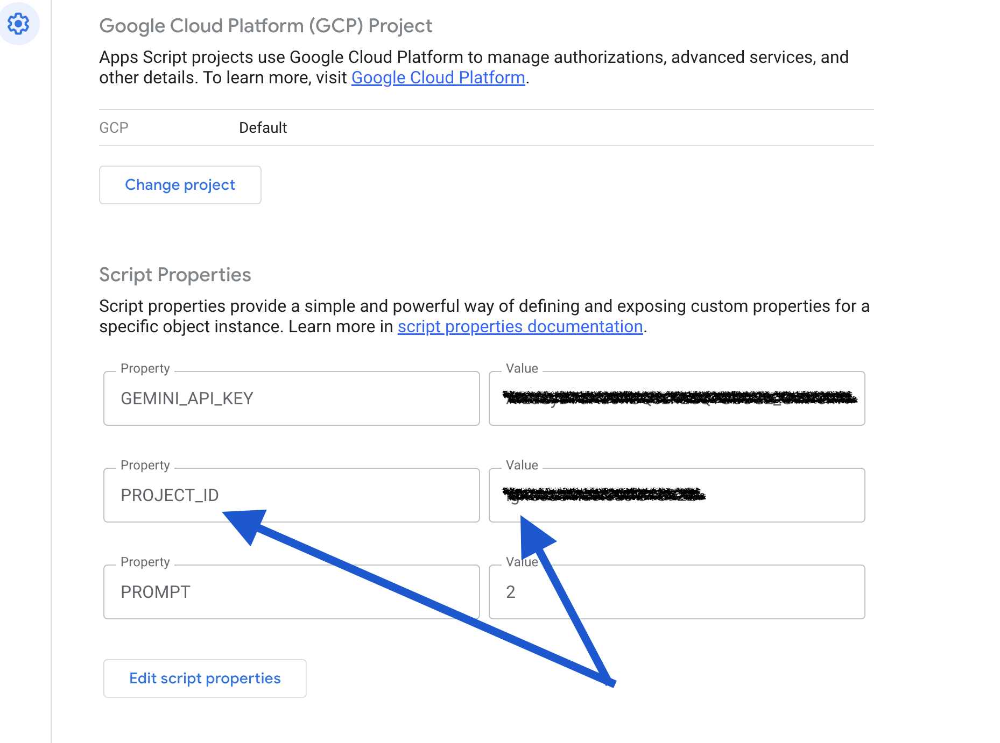

# Magic List

Use Google Workspace and Gemini to take your spreadsheet to the next level

_In this simple example, we're researching the CEO of each of the companies:_

https://developers.google.com/apps-script/guides/sheets

# 1. Make a copy of [this example sheet](https://docs.google.com/spreadsheets/d/11Ozz17fJID1l39iE-5oxlM5C9zYMoT7zuIWZuBA1EMk/edit?gid=0#gid=0)

# 2. Add AppScript to the Spreadsheet

By clicking  **Extentions** > **Apps Script**

# 3. Add all the AppScript code 

Paste all the code from the [appscript folder](/appscript) into the appscript editor.

# 4. Add your Google Cloud Project ID to Project Settings

- In your Google Cloud console, get a Project ID that has Vertex AI enabled
- Create a Script Property in the Project Settings
- Add the value of the Project ID into a Script Property called 'PROJECT_ID'

# 5. Add your Gemini API Key 

- If you don't have one, get it from [Google AI Studio](https://aistudio.google.com/apikey)
- Go to the Apps Script project settings
- Add the API key value to the Script Properties

# 6. Connect your prompt document

- Make a copy of the [Prompt Document](https://docs.google.com/document/d/14f8evBnu8iU6UmqyewSJKX8r2Ixu0iNfkIB8sIrSozE/edit?tab=t.0)
- Copy the new Document ID, example:
 

- Replace the existing value of *PROMPT_DOC_ID* in the *prompt_builder.gs* file with the new Document ID value

- Save the changes

# 7. Initilise the script 

In the AppScript console, **run** the `onOpen` function once manually.

There should now be a new tool item in your Sheet called 'Magic ✨'

# 8. You're ready for Magic
Select the cells you want to prompt
Click 'Magic ✨'
Click Generate, and the App Script will use Gemini and your prompt to iterate through your list and create insights or answers for each row

Switch between the prompts by selecting Settings and then set the prompt to match the prompt number in your Prompt Document
enter a new task and whilst its selected click `Justify work item` to generate impact. You can also highlight multiple Impact rows and have them summarised.

# 9. Add a trigger (Optional)
This will ensure the 'Magic ✨' button is always ready when you open the sheet

- In the App Script Code Editor
- Click Triggers

- Click 'Add Trigger' in the bottom right of the screen
- Click 'Save' to save the default trigger settings

